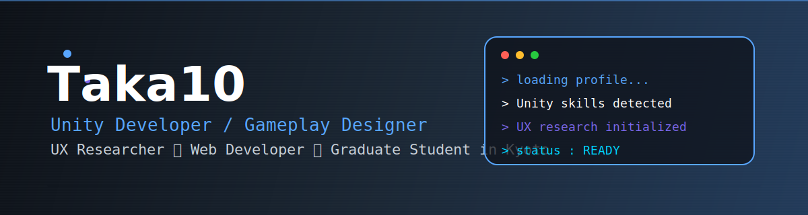

<!-- ==================== CUSTOM SVG HEADER ==================== -->

  

<!-- ==================== ABOUT ==================== -->

  I am majoring in Information Engineering at the Kyoto Institute of Technology Graduate School.
   
  I develop games with the student team <strong>TOMSN</strong>, mainly using <strong>Unity</strong>.
  My interests include gameplay design, UX research,
  and AI-driven interaction experiences in games.

  京都工芸繊維大学院で情報工学を専攻しています。
  また、学生チーム「<strong>TOMSN</strong>」でUnityを用いたゲーム開発を行っています。
  ゲームプレイ設計やUX研究、AIによるインタラクション体験にも興味があります。

<!-- ==================== DIVIDER ==================== -->

  

## 🎯 Strengths

> Game Development × UX Research × Web Engineering

- 🎮 Unityを使った2D / 3Dゲーム制作（企画・実装）
- 👾 BitSummit2025にてGameJam Award受賞
- 🏢 企業でのアルバイト経験（約2年）・インターンシップ経験
- 🌐 Vue / Nuxt / ReactによるWebサービス開発
- 📊 アンケートを用いたUX分析・研究
- 🤝 Git / Bitbucketを用いたチーム開発
- 📜 学会発表経験（ゲームの視覚情報と満足度の研究）

> Personal

- 🌎 タイへの短期留学経験
- 🏀 元100人規模の大学バスケットボールサークル代表
- 🎹 ピアノ（ドビュッシー / Game Music）
- 🏍️ ライダーです（GSX-250R）

## 🛠 Tech Stack

**📌 Languages**  

**🌐 Frontend / Web Frameworks**  

**🔧 Tools & Platforms**  

**🎮 Game / 3D Tools**  

`Tiled` `Photon` `Revo Scan`

**🛠️ Dev Environments**  

`Cursor`

**💬 Others / Collaboration**  

`Slack` `miro` `Redmine` `Google Workspace` `Microsoft Office` `PowerDirector` `Zapier` `Canva` 

**🧠 AI Assistants**

`ChatGPT` `Gemini` `Claude` `notebookLM`

---

## 🎮 My Games & Projects

| Title | Genre | Tech | Description | Code Link | Play Link |
|-------|-------|------|-------------|------|------|
| DreamMayDay | Cooperative | Unity, C# | BSGM2025で制作、総合グランプリ受賞|	[GitHub](https://github.com/BSGJ2025-w-12/DreamMayday_Scripts) | [itch.io](https://bitsummit-gamejam.itch.io/dreammayday) |
| CRASH REPORT | 3DAction | Unity, C# | TOMSN(学生チーム)での作品（PG&プランナー） |	[GitHub](https://github.com/TOMSNtomsn/CRASH-REPORT) | [unityroom](https://unityroom.com/games/crash_report) |
| 未定 | Adventure | Unity, C# | TOMSN(学生チーム)での第2弾（制作中） |	 |  |
| POGO・Stadium | Action Strategy | Unity, C# | アルバイトで企画・実装に携わったゲーム | — | [Steam](https://store.steampowered.com/app/3672410/POGO_Stadium) |
| 研究室からの脱出 | **Multi** Escape | Unity, C# | 研究室チームで制作したマルチプレイ脱出ゲーム |	[GitHub](https://github.com/taka100822/LabEscapeGame) | — |
| わけあい | 3DAction | Unity, C# | ハートを分け合って町を明るくするゲーム | [GitHub](https://github.com/taka100822/Unity1WeekGameJam_1st) | [unityroom](https://unityroom.com/games/wakeai) |
| 研究用ゲーム | 2DAction | Unity, C# | 視覚情報に関する研究 | [GitHub](https://github.com/taka100822/Graduation-Study) | [unityroom](https://unityroom.com/games/2d_actiongame) |
| パズルゲーム | Puzzle | Unity, C# | パズドラのようなパズルゲーム（練習用） | 	[GitHub](https://github.com/taka100822/puzzle-game) | [unityroom](https://unityroom.com/games/puzzlegame_practice) |
| Taka's Portfolio | Portfolio | JS, React | 今までの制作物をポートフォリオとして公開 |	[GitHub](https://github.com/taka100822/Portfolio-Site) | [Web](https://taka100822.github.io/Portfolio-Site/) |
| 研究室在籍管理システム | Microcomputer | Vue, JS, Python, Raspberry Pi | 研究室の在籍者を可視化するシステム |	[GitHub](https://github.com/Dev-LAB-entry-exit-system/attendance-board-raspberry-controller) | — |
| チャットアプリ | App | Vue, Nuxt | チャットアプリ | [GitHub](https://github.com/taka100822/chat-app) | — |
| 冷蔵庫管理アプリ | App | Vue, Nuxt | フロントエンドの1部分を担当 | [GitHub](https://github.com/KIT-HI-ProgrammingContestGroupC/fridge-manager) | 	— |
| 電卓&じゃんけんアプリ | App | Kotlin | インターンで作成(秘密保持制約よりデータなし) | — |	— |

---

## 🏢 Organization

- **[TOMSN](https://github.com/TOMSNtomsn)**  
  関西の学生8人によるの共同開発チーム
  ([Instagram](https://www.instagram.com/tomsn_works?igsh=MTlodm5pZHpwY3B1&utm_source=qr), [X](https://x.com/tomsn_works?s=21&t=quSap16NeGI_YNEzJMawBg), [unityroom](https://unityroom.com/users/tomsn))

- **[BSGJ2025-w-12](https://github.com/BSGJ2025-w-12)**  
  BitSummitGameJam2025での共同開発チーム

---

## 📈 GitHub Stats

  

## 📫 Contact

- X: https://x.com/taka10822GC
- Portfolio: https://taka100822.github.io/Portfolio-Site/
