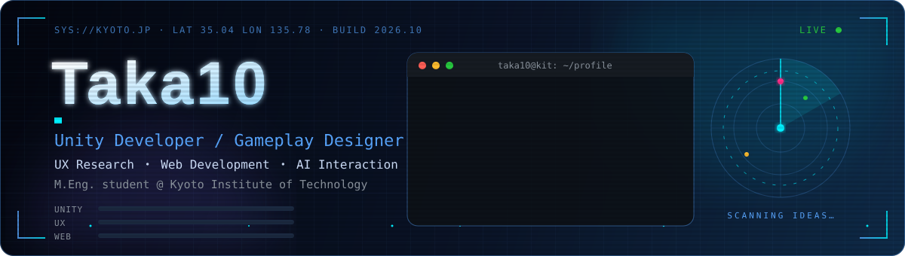

<!-- ==================== HEADER ==================== -->

  

  

  
  
  
  

<!-- ==================== ABOUT ==================== -->

  I am majoring in Information Engineering at the Kyoto Institute of Technology Graduate School.
   
  I develop games with the student team <strong>TOMSN</strong>, mainly using <strong>Unity</strong>.
  My interests include gameplay design, UX research,
  and AI-driven interaction experiences in games.

  京都工芸繊維大学院で情報工学を専攻しています。
  また、学生チーム「<strong>TOMSN</strong>」でUnityを用いたゲーム開発を行っています。
  ゲームプレイ設計やUX研究、AIによるインタラクション体験にも興味があります。

  

## 👨‍💻 Quick Profile

| | |
|---|---|
| 📍 **Location** | Kyoto, Japan |
| 🎓 **School** | 京都工芸繊維大学大学院 情報工学専攻 |
| 🎮 **Team** | [TOMSN](https://github.com/TOMSNtomsn)（学生ゲーム開発チーム） |
| 🔭 **Focus** | ゲームプレイ設計 / UX研究 / AIインタラクション |
| 🎹 **Hobbies** | ピアノ / バイク（GSX-250R）/ バスケットボール |

## 🎯 Strengths

> Game Development × UX Research × Web Engineering

- 🎮 Unityを使った2D / 3Dゲーム制作（企画・実装）
- 👾 BitSummit2025にてGameJam Award受賞
- 🏢 企業でのアルバイト経験（約2年）・インターンシップ経験
- 🌐 Vue / Nuxt / ReactによるWebサービス開発
- 📊 アンケートを用いたUX分析・研究
- 🤝 Git / Bitbucketを用いたチーム開発
- 📜 学会発表経験（ゲームの視覚情報と満足度の研究）

<b>👤 Personal</b>

 

- 🌎 タイへの短期留学経験
- 🏀 元100人規模の大学バスケットボールサークル代表
- 🎹 ピアノ（ドビュッシー / Game Music）
- 🏍️ ライダーです（GSX-250R）

## 🛠 Tech Stack

<table>
  <tr>
    <td><b>📌 Languages</b></td>
    <td></td>
  </tr>
  <tr>
    <td><b>🌐 Frontend / Web</b></td>
    <td></td>
  </tr>
  <tr>
    <td><b>🔧 Tools & Platforms</b></td>
    <td></td>
  </tr>
  <tr>
    <td><b>🎮 Game / 3D</b></td>
    <td>
       
      <code>Tiled</code> <code>Photon</code> <code>Revo Scan</code>
    </td>
  </tr>
  <tr>
    <td><b>🛠️ Dev Environments</b></td>
    <td>
       
      <code>Cursor</code>
    </td>
  </tr>
  <tr>
    <td><b>💬 Collaboration</b></td>
    <td>
       
      <code>Slack</code> <code>miro</code> <code>Redmine</code> <code>Google Workspace</code> <code>Microsoft Office</code> <code>PowerDirector</code> <code>Zapier</code> <code>Canva</code>
    </td>
  </tr>
  <tr>
    <td><b>🧠 AI Assistants</b></td>
    <td>
      
      
      
      
      
    </td>
  </tr>
</table>

---

## 🎮 My Games & Projects

| Title | Genre | Tech | Description | Code | Play |
|-------|-------|------|-------------|------|------|
| 🏆 **DreamMayDay** | Cooperative | Unity, C# | BSGM2025で制作、総合グランプリ受賞 |  |  |
| **CRASH REPORT** | 3D Action | Unity, C# | TOMSN(学生チーム)での作品（PG&プランナー） |  |  |
| **ふらちな海賊団** | Party | Unity, C# | 東京都武蔵野市で行われた学生チーム対抗ゲームジャム2026での作品（プランナー） | — |  |
| 🚧 **フリージア** | Adventure | Unity, C# | TOMSN(学生チーム)での第2弾となる言語解読ADV（制作中） |  | — |
| **POGO・Stadium** | Action Strategy | Unity, C# | アルバイトで企画・実装に携わったゲーム | — |  |
| **研究室からの脱出** | Multi Escape | Unity, C# | 研究室チームで制作したマルチプレイ脱出ゲーム |  | — |
| **わけあい** | 3D Action | Unity, C# | ハートを分け合って町を明るくするゲーム |  |  |
| **研究用ゲーム** | 2D Action | Unity, C# | 視覚情報に関する研究 |  |  |
| **パズルゲーム** | Puzzle | Unity, C# | パズドラのようなパズルゲーム（練習用） |  |  |
| **Taka's Portfolio** | Portfolio | JS, React | 今までの制作物をポートフォリオとして公開 |  |  |
| **研究室在籍管理システム** | Microcomputer | Vue, JS, Python, Raspberry Pi | 研究室の在籍者を可視化するシステム |  | — |
| **チャットアプリ** | App | Vue, Nuxt | チャットアプリ |  | — |
| **冷蔵庫管理アプリ** | App | Vue, Nuxt | フロントエンドの1部分を担当 |  | — |
| **電卓&じゃんけんアプリ** | App | Kotlin | インターンで作成(秘密保持制約よりデータなし) | 🔒 | — |

---

## 📊 GitHub Activity

  
  

  

  

  <picture>
    <source media="(prefers-color-scheme: dark)" srcset="https://raw.githubusercontent.com/taka100822/taka100822/output/github-snake-dark.svg" />
    <source media="(prefers-color-scheme: light)" srcset="https://raw.githubusercontent.com/taka100822/taka100822/output/github-snake.svg" />
    
  </picture>

---

## 🏢 Organization

- **[TOMSN](https://github.com/TOMSNtomsn)**  
  関西の学生8人による共同開発チーム
  ([Instagram](https://www.instagram.com/tomsn_works?igsh=MTlodm5pZHpwY3B1&utm_source=qr), [X](https://x.com/tomsn_works?s=21&t=quSap16NeGI_YNEzJMawBg), [unityroom](https://unityroom.com/users/tomsn))

- **[BSGJ2025-w-12](https://github.com/BSGJ2025-w-12)**  
  BitSummitGameJam2025での共同開発チーム

<!-- ==================== FOOTER ==================== -->

  

